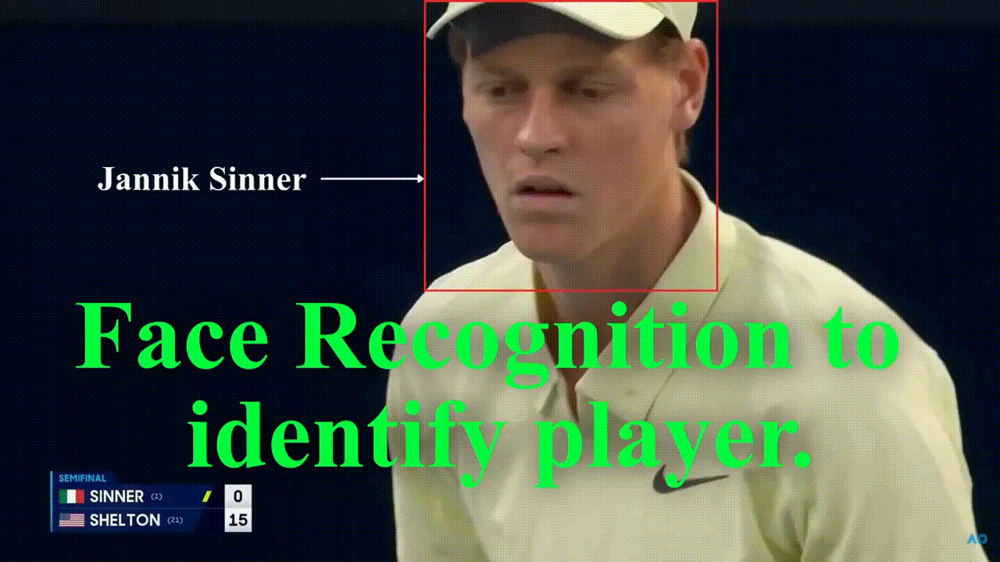
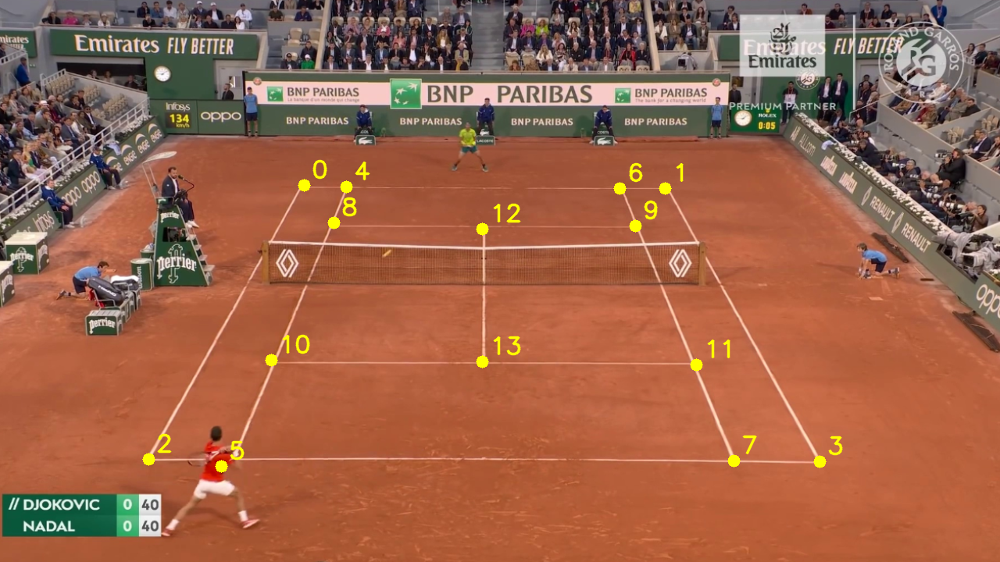

# Tennis Serve Extraction and Analysis 

<!--  -->
<center>


or watch the video here: https://youtu.be/53Lz9B7wAYQ

</center>


### Extracted the following informations:

From a tennis gameplay video, 

1) Identify a serve and extract the type for each of the serves (Flat / Kick / Slice) 
2) Determine the success of the Serve (in/out/let)
3) Calculate *toss height*, *toss position*, *hit height*, *serve speed* and *player speed*.

# Worflow
1) Firstly, a ConvNet network was trained to extract 14 marker points in the court. These 14 marker points are then connected as following to build the board:
    $$0 \rightarrow 4 \quad 4 \rightarrow 6 \quad 6 \rightarrow 1 \quad 0 \rightarrow 2 \quad 1 \rightarrow 3 \quad 4 \rightarrow 8 \quad 2 \rightarrow 5 \quad 8 \rightarrow 10 \quad 10 \rightarrow 5 \quad 9 \rightarrow 11 \quad 6 \rightarrow 9 \quad 11 \rightarrow 7 \quad 12 \rightarrow 13 \quad 5 \rightarrow 7 \quad 7 \rightarrow 3 \quad 10 \rightarrow 13  \quad 13 \rightarrow 11 \quad 8 \rightarrow 12 \quad 12 \rightarrow 9$$
    <br><br><br>
2) Another YOLO model detects the players, the ball and the net of the game. Net detection is nedded to identify if a server is **Let** or not. **Mediapipe** is used to identify the player pose for each detected players. Also, a *face recognizer ConvNet* has been trained to identify players of both side.
3) These players will be tracked throughout the match even if they switch side or camera moves to the audience and return back.
4) For understanding serve type, a **ConvNet + RNN** architecture has been used. Another ConvNet network tracks ball and player trajectory to understand when a serve started and when a serve finished. This ensure that we keep track of only the current recordings of a serve and previous serve data cannot intervine the output of the present serve data. Therefore, it is a gated RNN architecture where a custom game is used with CNN.


# Infernece
You can either run the whole pipeline to get the stats of a player. Or you can separetely run each of the step in workflow. We will start with seperate workflow first. If you need to run the whole pipeline at once, please check the bottom of the file.


The segmented video is used to train the model and then inference from it. This helps the model to only focus on relevant information and hence drastically reduces the data requirements. The following comamnd generates the segmented output.

```
!python make_segmentation.py \
  --input bin/data/inference/tennis_play_record_1_short_v2.mp4 \
  --output bin/data/output_segmented_video.avi
```